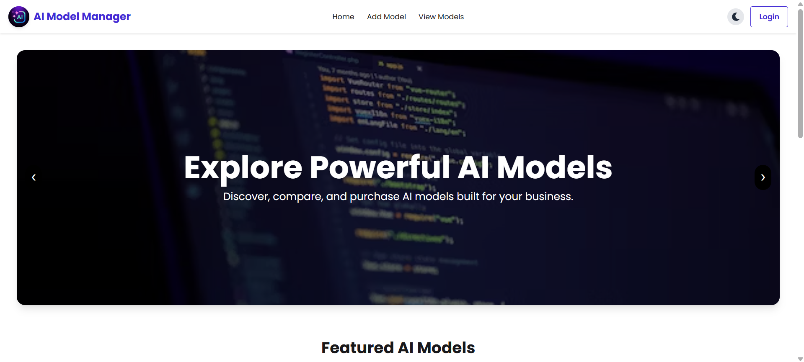

# 🧠 AI Model Inventory

<<<<<<< HEAD
🔗subtle-sprite-aab854.netlify.app
=======
## 🔗 Live Links & Resources
>>>>>>> ea7c3c7b85c4952a9ddf5a2428843bfff5fc6880

- 🌐 **Live Website:** https://stately-salamander-5e1fe6.netlify.app  
- 📁 **Client Repository:** https://github.com/TanvirReza1/ai-inventory-client.git  
- 📁 **Server Repository:** https://github.com/TanvirReza1/ai-inventory-server.git  



---

## 📖 About the Project

**AI Model Inventory** is a modern full-stack web application where users can explore, upload, and manage different AI models.  
It helps developers, researchers, and enthusiasts share, purchase, and keep track of innovative AI creations efficiently.

---

## ✨ Key Features

- 🔐 **Secure Authentication** — Login and Register system with Firebase Authentication.
- 📦 **Model Management** — Add, update, and delete your own AI models.
- 💰 **Purchase System** — Purchase AI models and view them under **My Purchases**.
- 🧩 **Private Routes** — Important pages like Add Model, My Models, and Purchases are protected for logged-in users.
- ⚡ **Dynamic Data Loading** — Models and details are fetched in real-time from the backend using Express + MongoDB.
- 🎨 **Responsive UI** — Fully responsive design built with React, TailwindCSS, and DaisyUI.

---

## 🛠️ Technologies Used

**Frontend**
- React
- React Router
- TailwindCSS
- DaisyUI
- SweetAlert2

**Backend**
- Node.js
- Express.js
- MongoDB

**Authentication**
- Firebase

**Hosting**
- Netlify (Client)
- Render / Vercel (Server)

---

## 📦 Dependencies Used

### Client-side
- react  
- react-router-dom  
- axios  
- firebase  
- sweetalert2  
- tailwindcss  
- daisyui  

### Server-side
- express  
- mongodb  
- cors  
- dotenv  
- jsonwebtoken  

---

## ⚙️ Environment Variables

### Client (.env)
```env
VITE_API_URL=your_server_url
VITE_FIREBASE_API_KEY=your_firebase_api_key
VITE_FIREBASE_AUTH_DOMAIN=your_firebase_auth_domain
VITE_FIREBASE_PROJECT_ID=your_firebase_project_id
```
🚀 How to Run the Project Locally
```
1️⃣ Run Client Side
git clone https://github.com/your-username/ai-model-inventory-client.git
cd ai-model-inventory-client
npm install
npm run dev

2️⃣ Run Server Side
git clone https://github.com/your-username/ai-model-inventory-server.git
cd ai-model-inventory-server
npm install
npm run start
